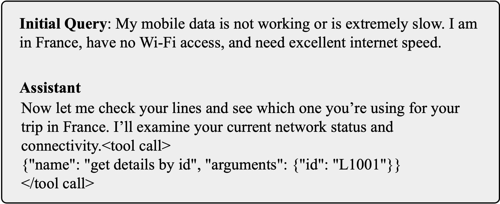
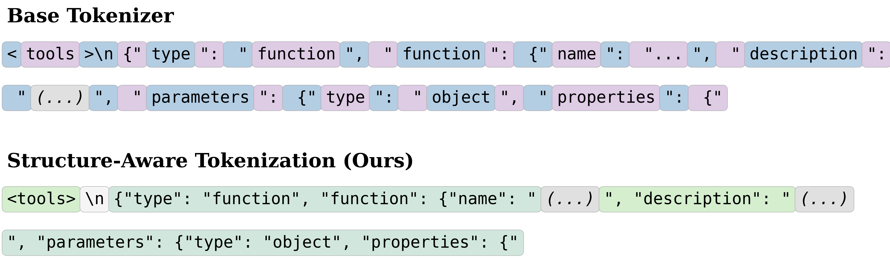
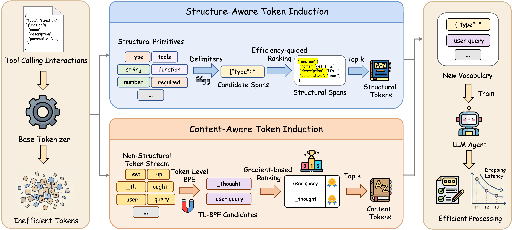
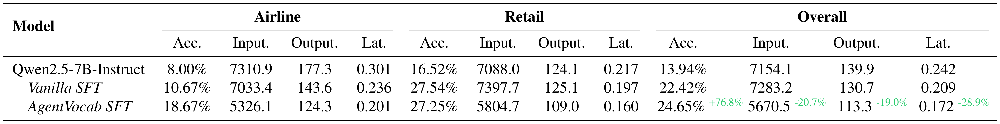
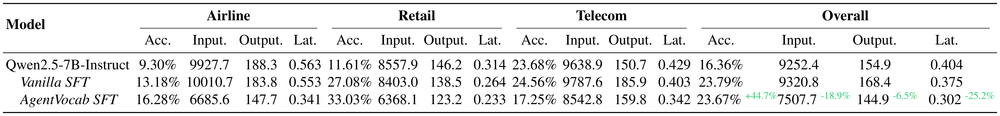
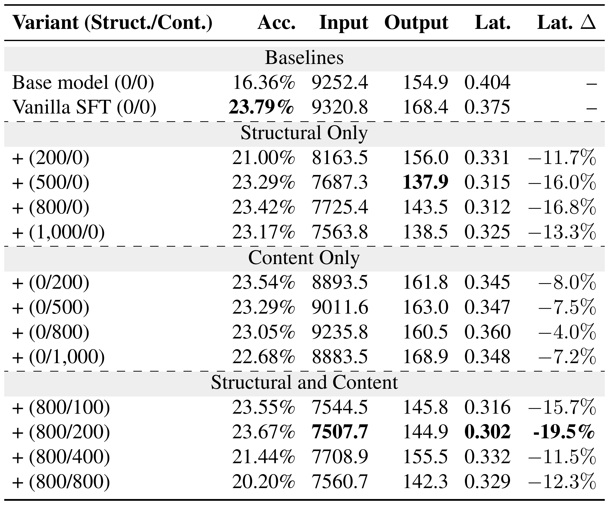

# AgentVocab

Official codebase for **AgentVocab: Structure-Aware Vocabulary Adaptation for Efficient LLM Agents**.

AgentVocab is a structure-aware vocabulary adaptation framework for efficient LLM agents. It mines real tool-calling traces, adds reusable structural and content fragments as new vocabulary entries, and uses two-stage LoRA SFT with vocabulary expansion in the second stage. The resulting tokenizer reduces tool-calling tokenization overhead while preserving competitive task performance.



## Highlights

- **Structure-aware token induction**: mines repeated tool-calling structures such as JSON-like schemas, function signatures, delimiters, and argument templates.
- **Content-aware token induction**: mines reusable content fragments with a TL-BPE + VEGAD-style gradient ranking pipeline.
- **Two-stage LoRA SFT**: first learns tool-calling behavior with the original tokenizer, then expands the vocabulary and continues LoRA SFT.
- **Reproducible evaluation utilities**: includes lightweight scripts for SWIFT Native + vLLM evaluation and result aggregation.

## Why AgentVocab?

LLM agents are typically trained with general-purpose tokenizers, but deployed in narrow tool-calling pipelines dominated by structured schemas, function calls, arguments, and tool observations. This creates a training-deployment mismatch: repeated tool-calling fragments are split into long token sequences, increasing context length and decoding latency.



## Method

AgentVocab mines structural patterns and content fragments from real tool-calling traces, then adapts the tokenizer through second-stage vocabulary expansion and LoRA SFT for agent deployment.



## Results Preview

AgentVocab reduces input tokens, output tokens, and latency while maintaining competitive aggregate task performance. Input/output tokens and latency are averaged per turn.

### tau-bench



### tau2-bench



### Vocabulary Budget Ablation

Structural tokens are the primary efficiency driver, and small content token budgets provide useful complements for balanced adaptation.



## Installation

```bash
git clone https://github.com/Starry-159/AgentVocab.git
cd AgentVocab
pip install -r requirements.txt
pip install -e .
```

Notes:

- AgentVocab uses `ms-swift[all]==3.12.6`. Do not replace it with SWIFT 4.x, because several scripts rely on SWIFT 3.x APIs.
- `requirements.txt` also includes `vllm`, `flash-attn`, `tau-bench`, and `tau2-bench` for reproducing training and evaluation.
- If SWIFT installation fails in your environment, follow the official SWIFT installation guide: https://swift.readthedocs.io/zh-cn/latest/
- `flash-attn` is CUDA/PyTorch-version sensitive. If installation fails, install the wheel or module matching your CUDA, PyTorch, and GPU environment.
- Large datasets, model checkpoints, raw predictions, and private API keys are intentionally not included in this repository.
- Long-running scripts print `[AgentVocab]` status messages and use `tqdm` progress bars for data conversion, rendering, token mining, reachability filtering, vocabulary expansion, and checkpoint export.

## Repository Structure

```text
AgentVocab/
├── assets/                 # paper figures and optional result renders
├── examples/               # training and evaluation shell templates
├── scripts/                # command-line entry points
├── src/agentvocab/         # reusable Python modules
└── requirements.txt        # SWIFT 3.12, evaluation, and utility dependencies
```

## Quick Start

If your data is already in SWIFT agent format, start from step 2.

```bash
# 1. Convert Toucan parquet files to SWIFT agent JSONL.
python scripts/convert_toucan_to_swift.py \
  --input-dir /path/to/Toucan-1.5M/SFT \
  --output outputs/data/toucan_swift_agent_format.jsonl

# 2. Render SWIFT data into the actual model inputs seen by the tokenizer.
python scripts/render_swift_actual_content.py \
  --input outputs/data/toucan_swift_agent_format.jsonl \
  --output outputs/data/agent_train_actual_content.jsonl \
  --model /path/to/Qwen2.5-7B-Instruct \
  --agent-template hermes

# 3. Filter valid records and render them again for token mining.
python scripts/filter_valid_data.py \
  --input outputs/data/agent_train_actual_content.jsonl \
  --output outputs/data/toucan_swift_agent_format_valid.jsonl

python scripts/render_swift_actual_content.py \
  --input outputs/data/toucan_swift_agent_format_valid.jsonl \
  --output outputs/data/toucan_swift_agent_format_valid_actual_content.jsonl \
  --model /path/to/Qwen2.5-7B-Instruct \
  --agent-template hermes

# 4. Split rendered inputs into structural and content streams.
python scripts/split_structural_content.py \
  --input outputs/data/toucan_swift_agent_format_valid_actual_content.jsonl \
  --structural-output outputs/data/structural_spans.txt \
  --content-output outputs/data/content_text.txt
```

## Token Mining

### Structural Tokens

```bash
python scripts/mine_structural_tokens.py \
  --input outputs/data/structural_spans.txt \
  --tokenizer /path/to/Qwen2.5-7B-Instruct \
  --output outputs/tokens/structural_scored.json \
  --max-new-tokens 10000 \
  --min-frequency 10
```

### Content Tokens

Content tokens are mined with the complete TV3-style pipeline: **TL-BPE candidate mining + VEGAD-style gradient ranking**.

```bash
python scripts/mine_content_tokens.py \
  --input outputs/data/content_text.txt \
  --tokenizer /path/to/Qwen2.5-7B-Instruct \
  --corpus outputs/data/toucan_swift_agent_format_valid_actual_content.jsonl \
  --model /path/to/stage1/checkpoint-or-base-model \
  --output outputs/tokens/content_scored.json \
  --max-new-tokens 10000 \
  --min-frequency 10 \
  --max-subwords 4 \
  --sample-size 1000 \
  --max-seq-len 4096
```

### Reachability Filtering

Structural and content tokens share the same reachability filtering step. This simulates tokenizer insertion and keeps tokens that are actually selected on rendered training inputs.

```bash
python scripts/select_reachable_tokens.py \
  --scored-tokens outputs/tokens/structural_scored.json \
  --corpus outputs/data/toucan_swift_agent_format_valid_actual_content.jsonl \
  --tokenizer /path/to/Qwen2.5-7B-Instruct \
  --output-dir outputs/tokens \
  --token-type structural \
  --targets 200 500 800 1000

python scripts/select_reachable_tokens.py \
  --scored-tokens outputs/tokens/content_scored.json \
  --corpus outputs/data/toucan_swift_agent_format_valid_actual_content.jsonl \
  --tokenizer /path/to/Qwen2.5-7B-Instruct \
  --output-dir outputs/tokens \
  --token-type content \
  --targets 100 200 400 800
```

### Mix Structural and Content Tokens

```bash
python scripts/mix_tokens.py \
  --inputs outputs/tokens/top_800_reachable_structural_tokens.json \
           outputs/tokens/top_200_reachable_content_tokens.json \
  --output outputs/tokens/top_1000_mixed_tokens.json
```

## Vocabulary Expansion

New token embeddings and LM-head rows are initialized by averaging the original subtoken vectors.

```bash
python scripts/expand_tokenizer.py \
  --base-model /path/to/stage1/checkpoint \
  --tokens outputs/tokens/top_1000_mixed_tokens.json \
  --output outputs/models/expanded_agentvocab_step0 \
  --device-map cpu
```

## Training

AgentVocab uses two-stage LoRA SFT.

```bash
# Stage 1: ordinary LoRA SFT without vocabulary expansion.
bash examples/train_stage1_lora.sh

# Stage 2: continue LoRA SFT after vocabulary expansion.
bash examples/train_stage2_lora.sh
```

Before running, edit the model, dataset, output, GPU, and port variables in the scripts or pass them as environment variables.

## Export LoRA Checkpoints

For vLLM evaluation, merge LoRA checkpoints into full model directories:

```bash
python scripts/merge_lora_checkpoints.py \
  --series-dir outputs/stage2_lora_series \
  --base-model outputs/models/expanded_agentvocab_step0 \
  --output-dir outputs/models \
  --output-prefix AgentVocab-Step
```

The exporter copies tokenizer files directly from the expanded Step0 model to preserve token-id mappings.

## Evaluation

For a simple single-GPU SWIFT Native + vLLM evaluation:

```bash
TAU_BENCH_API_KEY=<your-key> \
MODEL_PATH=outputs/models/AgentVocab-StepXXXX \
MODEL_NAME=AgentVocab \
EVAL_DATASET=tau2_bench \
GPU_ID=0 \
PORT=10000 \
bash examples/evaluate_swift_native.sh
```

The example script is intentionally minimal and does not include multi-GPU scheduling. Do not commit API keys or private benchmark logs.

Aggregate tidy result files:

```bash
python scripts/aggregate_results.py \
  --input outputs/eval/tidy_results.xlsx \
  --output outputs/eval/overall_results.xlsx
```

## Citation

If you use this code, please cite:

```bibtex
@inproceedings{bian2026agentvocab,
  title = {AgentVocab: Structure-Aware Vocabulary Adaptation for Efficient LLM Agents},
  author = {Bian, Kai and Mo, Haosi and Liu, Xuebo and Song, Shuangyong and Li, Jing and Li, Yongxiang and Zhang, Min and Li, Xuelong},
  booktitle = {Proceedings of the 43rd International Conference on Machine Learning},
  year = {2026}
}
```

## License

License information will be updated.
