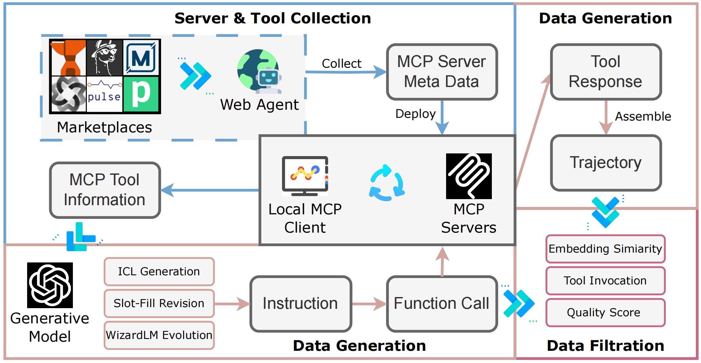
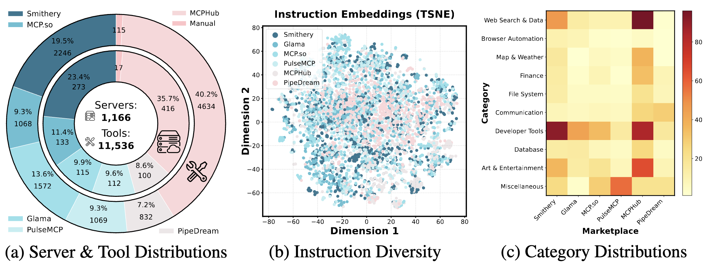
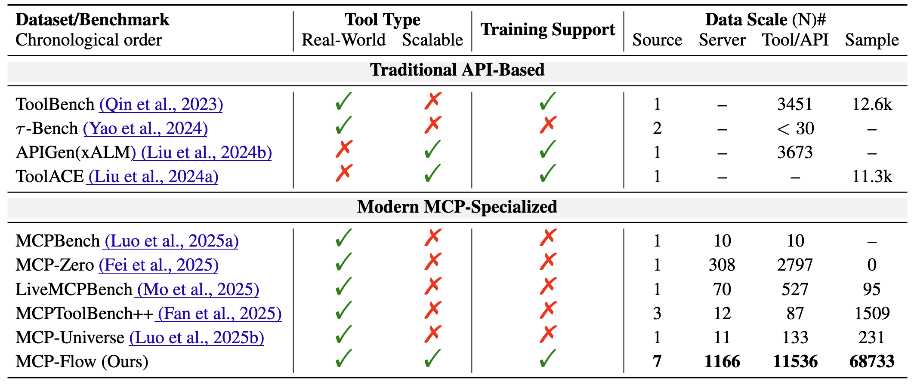

# MCP-Flow

**Facilitating LLM Agents to Master Real-World, Diverse and Scaling MCP Tools**
> 📄 [Paper Url](https://arxiv.org/abs/2510.24284)


## 🗓️ News

* **🎉 Apr 6, 2026** — We are happy to announce that MCP-Flow has been accepted to the **Main Conference of ACL 2026**!
* **🧠 Oct 28, 2025** — MCP-Flow is released on [**arXiv**](https://arxiv.org/abs/2510.24284).
* **🛠️ Nov 10, 2025** — We open-source all the **server configurations** and **tool information**!
* **🛠️ Nov 28, 2025** — We open-source all the **instruction-function call pairs** and the **testsets for evaluation** inluding in-domain and OOD settings! The dataset is available at [HuggingFace]( https://huggingface.co/datasets/wwh0411/MCP-Flow.)


## 📝 Introduction

**MCP-Flow** is an automated **web-agent-driven pipeline** for large-scale **server discovery**, **data synthesis**, and **model training** in the **Model Context Protocol (MCP)** ecosystem.

### 🌐 Key Features

* 🤖 **Automated server collection** from *6 major MCP marketplaces*  

  <p align="center">
    
  </p>

* 📊 **Extensive tool coverage:** 1,166 real-world servers, 11,536 tools, and 68K+ instruction–function call pairs  

  <p align="center">
    
  </p>

* 🧩 **Scale & diversity** far beyond previous benchmarks  

  <p align="center">
    
  </p>


## 📂 Datasets

| Category                         | Path                                           | Description                                                 |
| -------------------------------- | ---------------------------------------------- | ----------------------------------------------------------- |
| 🧠 Function calls & trajectories | `./data/function_call/` & `./data/trajectory/` | Example data; full datasets are released on [HuggingFace]( https://huggingface.co/datasets/wwh0411/MCP-Flow) |
| ⚙️ MCP configurations            | `./data/mcp_config/`                           | Configuration files for discovered servers                  |
| 🧰 Tool information              | `./data/tools/`                                | Tool descriptions and schema definitions                    |
| 💻 Source code                   | `./src/`                                       | Core scripts for server deployment    |
| 📲 Testset                   | `./test_data` on HuggingFace                                  | Including in-domain and out-of-domain evaluation settings    |
 

## 🛠️ Installation

```bash
git clone https://github.com/<your-org>/MCP-Flow.git
cd MCP-Flow
pip install -r requirements.txt
```


## 🧾 Citation

If you find **MCP-Flow** useful in your research, please consider citing:
```bibtex
@misc{wang2025mcpflowfacilitatingllmagents,
      title={MCP-Flow: Facilitating LLM Agents to Master Real-World, Diverse and Scaling MCP Tools}, 
      author={Wenhao Wang and Peizhi Niu and Zhao Xu and Zhaoyu Chen and Jian Du and Yaxin Du and Xianghe Pang and Keduan Huang and Yanfeng Wang and Qiang Yan and Siheng Chen},
      year={2025},
      eprint={2510.24284},
      archivePrefix={arXiv},
      primaryClass={cs.AI},
      url={https://arxiv.org/abs/2510.24284}, 
}
```


## 📧 Contact
If you have any questions or encounter issues, feel free to open an issue or reach out to the authors directly:

📮 Email: 12321254@zju.edu.cn  
💬 WeChat: <br> 
